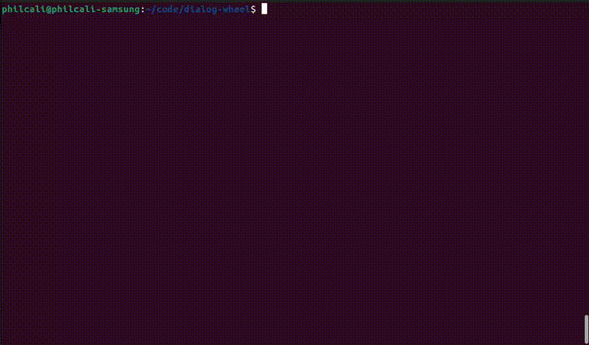

# Dialog Wheel

The bash [dialog][1] program is a powerful TUI tool, very suitable for single
page flows. The user of a `dialog` is on their own for establishing complex
workflows and decision trees.

Enter `dialog-wheel`, which is intended to allow a hub / spoke UX overlay
for dialog single page displays.



See the [workflow documentation](WORKFLOW.md) for more workflow schema.

## What does wheel handle?

- State Management
- Page progression, backward and forward
- Required and optional forms

## What are wheel's dependencies?

- `dialog` (Optional)
- `jq`
- `bc`
- `python3` (Optional for yaml support)

## What if I refuse to install dialog?

The `dialog-wheel` framework will degrade to a pure bash TUI, whose
entrypoint is the `wheel::dialog::app` function found in the `dialog` module,
if the `dialog` program cannot be found on the `$PATH`. All other aspects
of `dialog-wheel` still apply, including the `SIGINT` capture and error
handlers and the static state machine. Note that `wheel::dialog::app` is
meant to be __backup__ to a fully featured TUI program, so it's presentation
is slightly improved over a traditionally `echo`'ed UI.

## Wait... that means you support other TUI programs?

Indeed. In the JSON definition for the state machine, `dialog.program` can
reference a function or a command to replace all calls normally directed to
`dialog`. The only caveat is that the program arguments match the `dialog`
program interface. Perhaps in a future release, the calls will use its own
abstraction, but for now that's an exercise for the reader.

## Conditional Render and Branching Logic

The `dialog-wheel` program will parse special functions to render different
paths on `next` or `back`.

- `!ref`: pulls data our of the managed application state
``` yaml
MyScreen:
  capture_into: state.boolean
  type: yesno
  properties:
    text: Do you like bananas?
  handlers:
    ok: wheel::handlers::cancel
    cancel:
    - wheel::handlers::flag
    - wheel::handlers::cancel
    capture_into: wheel::handlers::flag
Confirmed:
  type: msgbox
  condition:
    "!ref": state.boolean
  properties:
    text: You did it. Go to the next page
  next: Another
Another:
  type: msgbox
  properties:
    text: Just another page
```
- `!if`: applies a truth and false path
``` yaml
MyScreen:
  type: msgbox
  properties:
    text: Enter next if you want to continue.
  next:
    "!if":
    - "!ref": state.boolean
    - TruthPage
    - FalsePage
```

## How do I install it?

The example includes a `Dockerfile` for testing the application. If you want
to install the script to be invoked somewhere in your `PATH`, then I would
recommend the following:

__Using Git__
```
git clone https://github.com/philcali/dialog-wheel.git && cd dialog-wheel && ./dev.build.sh && {
  IFS=':' read -r -a paths <<< "$PATH"
  for path in "${paths[@]}"
  do
    mv dialog-wheel "$path/" && echo "Installed dialog-wheel in $path" && break
  done
} || echo >&2 "Failed to install dialog-wheel"
```

If you feel like removing it, then it's as easy as:

```
rm $(which dialog-wheel)
```

## How do I test this?


Build the container:

```
docker build -t dialog-wheel .
```

Run it like below:
```
docker run -it --rm --name dialog-wheel dialog-wheel -h
```

The `help` should print below
```
Usage main.sh - v1.0.0: Invoke a dialog wheel
Example usage: main.sh [-h] [-v] [-d state.json] [-o output.json] [-l app.log] [-L TRACE|DEBUG|INFO|WARN|ERROR|FATAL] [-s START_SCREEN] [-i workflow.json] [< workflow.json]
  -o, --state-output: Supply an output path for JSON state data (defaults to fd 3)
  -d, --state-input:  Supply a JSON file representative of existing state data (defaults to none)
  -i, --input:        Supply a JSON file that represents the dialog state machine (defaults to /dev/stdin)
  -s, --start:        Supply a screen name to start the state machine (defaults to none)
  -l, --log-file:     Supply a log source (defaults to /dev/null)
  -L, --log-level:    Supply a log level (defaults to INFO)
  -y, --yaml:         Hint to read stdin and write state data as yaml
  -v, --version:      Prints out the version and exits
  -h, --help:         Prints out this help
```

To run the example application for `example.json`, simply mount the `$PWD` into `/wheel` like so:

```
docker run -it --rm --name dialog-wheel -v $PWD:/wheel dialog-wheel -s example.json -l application.log
```

[1]: https://linuxcommand.org/lc3_adv_dialog.php
