## Workflow Schema

The brains behind the `dialog-wheel` program reside in a JSON data structure
resembling a state machine. The program encourages the separation of the
UX flow from the control layer of the UI.

### The Workflow

- `version`: (required) `"1.0.0"`
- `screens`: (required) subdocument of `screen` objects
- `dialog`: (optional) subdocument to define common dialog parameters
- `start`: (optional) string of the starting `screen`
- `exit`: (optional) string of the "exit capture" `screen`
- `error`: (optional) string of the "uncaught error" `screen`
- `handlers`: (optional) string or array of strings handlers
- `includes`: (optional) array of scripts for the control layer

__JSON__
``` json
{
    "version": "1.0.0",
    "dialog": {
        "backtitle": "Example App"
    },
    "screens": {
        "Message": {
            "type": "msgbox",
            "properties": {
                "text": "This is some text"
            }
        }
    },
    "start": "Message"
}
```

__YAML__
``` yaml
version: "1.0.0"
dialog:
    backtitle: Example App
screens:
    Message:
        type: msgbox
        properties:
            text: This is some text
start: Message
```

### Inclusions

An inclusion defines the relative or absolute path to a script that defines
a function or set of functions to be used in the workflow definition. An
inclusion can consist of `handler` functions, arbitrary scripts invoked in
`custom` screens, `event` handlers, and everything in between. The inclusions
are basically user-defined functions that are invoked by `dialog-wheel`.

- `file`: (required) relative or absolute path of scripts who control the app
- `directory`: (optional) relative pr absolute path of script folders

__JSON__
``` json
"includes": [
    {
        "directory": "exmaples",
        "file": "application.sh"
    }
]
```

__YAML__
``` yaml
includes:
- directory: examples
  file: application.sh
```

### Screen

The screen object contains the static definition for rendering a single page
node in an otherwise expansive decision tree. 

- `type`: (required) Various screen types
- `properties`: (required) subdocument of properties in for screen types
- `capture_into`: (optional) JSON path string to set the internal state
- `dialog`: (optional) subdocument of dialog properties
- `next`: (optional) string or conditional
- `back`: (optional) string or conditional
- `handlers`: (optional) string or array of string handlers
- `clear_history`: (optional) flag that signals the workflow engine to clear the stack tracking visited nodes.

Common properties shared between *most* screen types are:

- `text`: (optional) string label of the screen
- `width`: (optional) integer fixed width of the screen
- `height`: (optional) integer fixed height of the screen

__JSON__
``` json
"Message Box": {
    "dialog": {
        "colors": true,
        "title": "Alert"
    },
    "type": "msgbox",
    "properties": {
        "text": "This is just some message notification."
    },
    "next": "Some Other Page"
}
```

__YAML__
``` yaml
"Message Box":
    dialog:
        colors: True
        title: Alert
    type: msgbox
    properties:
        text: This is just some message notification.
    next: Some Other Page
```

### Screen Types

The `dialog-wheel` is a hub and spoke model TUI workflow engine. So which
are the *hubs* and which are the *spokes*? This section defines the 
screen types and their properties.

#### Hub

The `hub` is how to render a "menu" whose actions are supposed to take a user
to different screens (thus, the name `hub`). The following properties are
additive to the general screen properties:

- `items`: (required) an array of `item` documents
- `text`: (optional) string of text before the menu is rendered
- `menu_height`: (optional) integer of how many rows of the inner menu

To get the most out of a menu, set the `handlers.ok` to be the 
`wheel::screens::hub::selection` method. Upon selecting a menu item, the
`next_screen` will be overridden to its value.

__JSON__

``` json
"Main Menu": {
    "type": "hub",
    "properties": {
        "items": [
            {
                "name": "First Page",
                "description": "This is the first page"
            },
            {
                "name": "Second Page",
                "description": "This is the second page"
            }
        ]
    },
    "handlers": {
        "ok": "wheel::screens::hub::selection"
    }
}
```

__YAML__
``` yaml
Main Menu:
    type: hub
    properties:
        items:
        - name: First Page
          description: This is the first page
        - name: Second Page
          description: This is the second page
    handlers:
        ok: wheel::screens::hub::selection
```

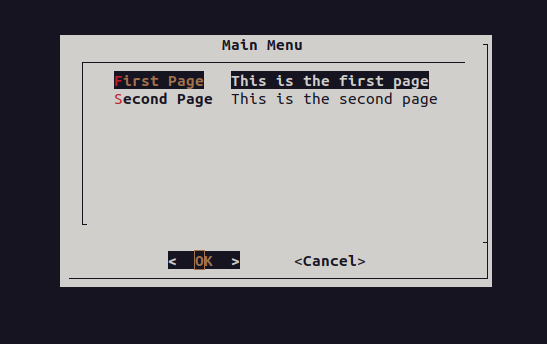

#### Message

The `msgbox` type is basically an alert message. The key properties
for a `msgbox` are:

- `text`: (required) string of text

__JSON__
``` json
"Message": {
    "type": "msgbox",
    "properties": {
        "text": "Hi"
    }
}
```

__YAML__
``` yaml
Message:
    type: msgbox
    properties:
        text: Hi
```

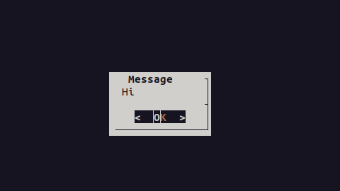

#### Confirmation

The `yesno` type is the confirmation dialog box. The key properties
for `yesno` are:

- `text`: (required) string of text

Note: that if `dialog` is the underlying TUI rendering program, then all
of the `dialog` options are availble.

__JSON__

``` json
"Confirmation": {
    "type": "yesno",
    "properties": {
        "text": "Do you like bananas?"
    }
}
```

__YAML__
``` yaml
Confirmation:
    type: yesno
    properties:
        text: Do you like bananas?
```

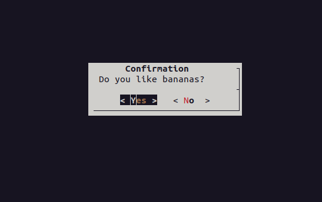

#### Input

The `input` is just a plain text input element. The key properties
for an `input` is:

- `capture_into`: (optional) state field to store the value
- `text`: (optional) string label for the input box

__JSON__
``` json
"Username": {
    "type": "input",
    "capture_into": "user.name",
    "properties": {
        "text": "Enter your username"
    }
}
```

__YAML__
``` yaml
Username:
    type: input
    capture_into: user.name
    properties:
        text: Enter your username
```

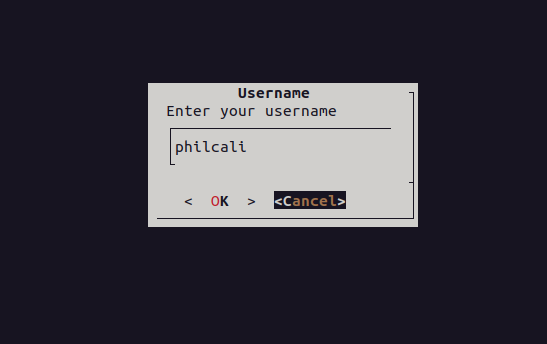

__State__

``` yaml
user:
    name: philcali
```

#### Checklist

The `checklist` type allows a user to select one or more items in a list
of items. The key properties of the `checklist` are:

- `items`: (required) array of item documents
- `text`: (optional) string that labels the list
- `capture_into`: (optional) the state field to store selections

Note: to get the most out of the `checklist`, use one of the two provided
handlers in `handlers.capture_into` to store into the state:

- `wheel::screens::checklist::list`: stores the selected values as an array
- `wheel::screens::checklist::field`: stores the selected values as an object with the fields in the object as booleans

__JSON__

``` json
"Checklist": {
    "type": "checklist",
    "capture_into": "favorite.fruit",
    "properties": {
        "text": "Select your favorite",
        "items": [
            {
                "name": "Apples",
                "description": "Once day keeps the doc at bay"
            },
            {
                "name": "Bananas",
                "description": "High potassium, delicious"
            },
            {
                "name": "Plum",
                "description": "Sweet, watery, delicious"
            }
        ]
    }
}
```

__YAML__
``` yaml
Checklist:
    type: checklist
    capture_into: favorite.fruit
    properties:
        text: Select your favorite
        items:
        - name: Apples
          description: Once a day keeps the doc at bay
        - name: Bananas
          description: High potassium, delicious
        - name: Plum
          description: Sweet, watery, delicious
```

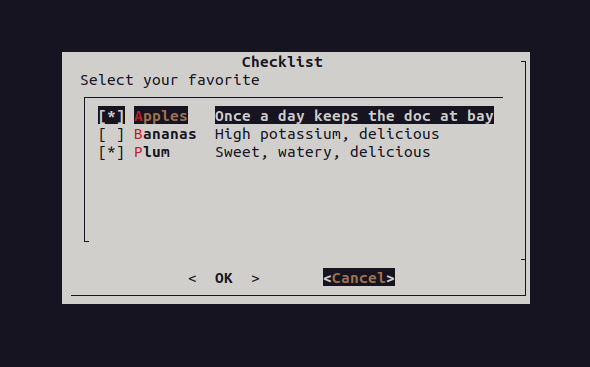

__State: List__

``` yaml
favorite:
    fruit:
    - Apples
    - Plum
```

__State: Field__
``` yaml
favorite:
    fruit:
        Apples: True
        Bananas: False
        Plum: True
```

#### Radiolist

The `radiolist` type will allow the user to select one item in a list
of items. The UI is different from the `hub` in that selection is
additional to just pressing "OK". The key properties are:

- `items`: (required) array of item documents
- `text`: (optional) string labeling the radio list
- `capture_into`: (optional) state field to update with selected value

__JSON__
``` json
"Radiolist": {
    "type": "radiolist",
    "capture_into": "favorite.fruit",
    "properties": {
        "text": "Select your favorite",
        "items": [
            {
                "name": "Apples",
                "description": "Once day keeps the doc at bay"
            },
            {
                "name": "Bananas",
                "description": "High potassium, delicious"
            },
            {
                "name": "Plum",
                "description": "Sweet, watery, delicious"
            }
        ]
    }
}
```

__YAML__

``` yaml
Radiolist:
    type: radiolist
    capture_into: favorite.fruit
    properties:
        text: Select your favorite
        items:
        - name: Apples
          description: Once a day keeps the doc at bay
        - name: Bananas
          description: High potassium, delicious
        - name: Plum
          description: Sweet, watery, delicious
```

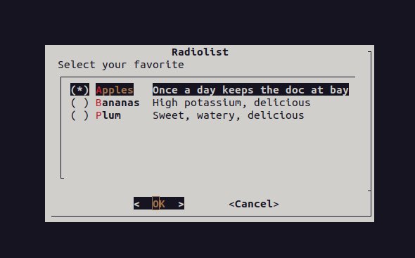

__State__

``` yaml
favorite:
    fruit: Apples
```

#### Range

The `range` type allows a user to input a numerical range. The key properties
of a `range` are:

- `text`: (optional) string label of the range
- `capture_into`: (optional) string of the state field
- `min`: (optional) integer of the minimum value
- `max`: (optional) integer of the maximum value
- `default`: (optional) integer of the default value in the absence of state

__JSON__

``` json
"Range": {
    "type": "range",
    "capture_into": "range",
    "properties": {
        "text": "Select a value between 0 and 10",
        "min": 0,
        "max": 10,
        "width": 70
    }
}
```

__YAML__

``` yaml
Range:
  type: range
  capture_into: range
  properties:
    text: Select a value between 0 and 10
    min: 0
    max: 10
    width: 70
```

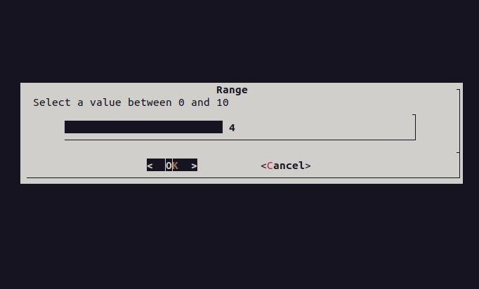


__State__

``` yaml
range: 4
```

#### Calendar

The `calendar` type allows a user to input a date. The key properties of a
`calendar` are:

- `text`: (optional) string label of the calendar
- `capture_into`: (optional) string of the state field

__JSON__

``` json
"Calendar": {
    "type": "calendar",
    "capture_into": "user.birthdate",
    "properties": {
        "text": "Enter birthdate"
    }
}
```

__YAML__

``` yaml
Calendar:
    type: calendar
    caprture_into: user.birthdate
    properties:
        text: Enter birthdate
```

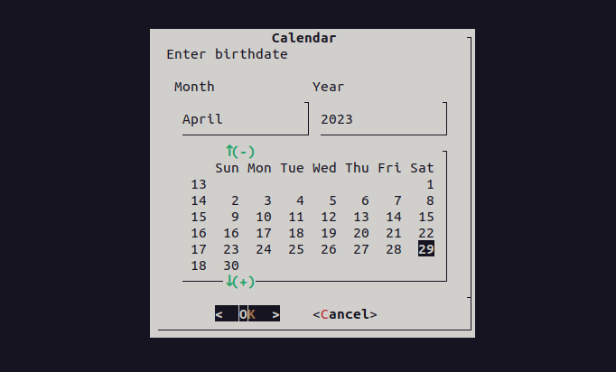

__State__

``` yaml
user:
    birthdate: 29/04/2023
```

#### Files

The `files` type allows a user to select a specific file. The key properties
of a `files` type are:

- `capture_into`: (optional) string state field
- `text`: (optional) string value for selected field

__JSON__

``` json
"Files": {
    "type": "files",
    "capture_into": "selected.file",
    "properties": {
        "text": "$state.selected.file"
    },
    "handlers": {
        "ok": "wheel::screens::files::select"
    }
}
```

__YAML__

``` yaml
Files:
    type: files
    capture_into: selected.file
    properties:
        text: "$state.selected.file"
    handlers:
        ok: wheel::screens::files::select
```

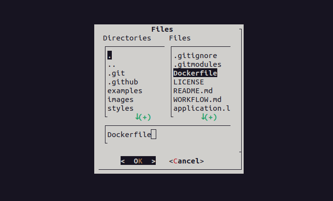

__State__

``` yaml
selected:
    file: Dockerfile
```

#### Textbox

The `textbox` type allows a user to read a file, either selected from the
`files` type or other source. The key properties of a `textbox` are:

- `text`: (optional) string of the file to open
- `capture_into`: (optional) string of the state field

__JSON__

``` json
"Open File": {
    "type": "textbox",
    "properties": {
        "text": "$state.selected.file"
    }
}
```

__YAML__

``` yaml
Open File:
    type: textbox
    properties:
        text: "$state.selected.file"
```

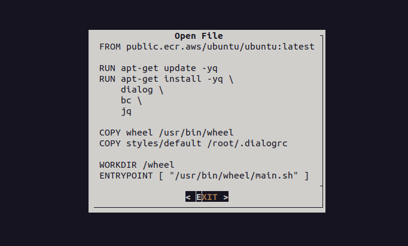

#### Editbox

The `editor` type allows a user to edit a file, either selected from the
`files` type or other source. The key properties of a `editor` are:

- `text`: (optional) string of the file to edit
- `capture_into`: (optional) string of the state field

Note: to get the most out of an `editor` type, override the `handlers.ok`
event with the built-in `wheel::screens::editor::save`, which will update
the edited file with new values.

__JSON__

``` json
"Edit File": {
    "type": "editor",
    "properties": {
        "text": "$state.selected.file"
    },
    "handlers": {
        "ok": "wheel::screens::editor::save"
    }
}
```

__YAML__

``` yaml
Edit File:
    type: editor
    properties:
        text: "$state.selected.file"
    handlers:
        ok: wheel::screens::editor::save
```

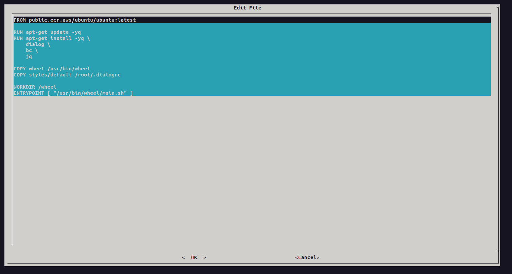

#### Form

The `form` type allows a user to input multiple fields. You can mix plain text
entry with password types. The key properties of a `form` are:

- `items`: (required) array of `item` documents
- `text`: (optional) label of the form
- `capture_into`: (optional) state field to hydrate

Getting the most out of a `form` means setting the `handlers.capture_into` to
`wheel::screens::form::save`.

__JSON__

``` json
"Form": {
    "type": "form",
    "capture_into": "address",
    "properties": {
        "text": "Enter your mailing address",
        "items": [
            {
                "name": "Street",
                "configures": "street",
                "length": 40
            },
            {
                "name": "City",
                "configures": "city",
                "length": 20
            },
            {
                "name": "State",
                "configures": "state",
                "length": 15
            },
            {
                "name": "Zip Code",
                "configures": "zipcode"
            }
        ]
    },
    "handlers": {
        "capture_into": "wheel::screens::form::save"
    }
}
```

__YAML__

``` yaml
Form:
  type: form
  capture_into: address
  properties:
    text: Enter your mailing address
    items:
    - name: Street
      configures: street
      length: 40
    - name: City
      configures: city
      length: 20
    - name: State
      configures: state
      length: 15
    - name: Zip Code
      configures: zipcode
  handlers:
    capture_into: wheel::screens::form::save
```

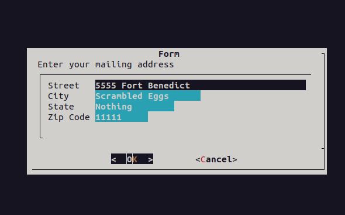

__State__

``` yaml
address:
    street: 5555 Fort Benedict
    city: Scrambled Eggs
    state: Nothing
    zipcode: 11111
```

#### Gauge

The `gauge` is the the "progress bar" of the TUI to indicate that work is
being done. While the screen can be used for any loading action, typically
the `gauge` is used to indicate that actions are being performed. There are
two forms of `gauge`. A managed gauge (default), and unmanaged gauge.

- `actions`: array of `action` objects
- `text`: string of the initial text

__Managed__

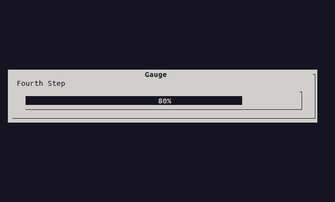

__Unmanaged__

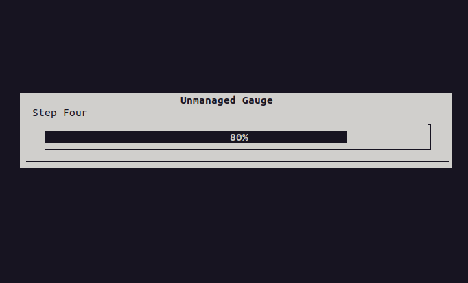


The definition for both are included. Note that actions references are
recommended to be function names brought in by inclusions. The definitions
below are simply used for demonstration purposes.

__JSON__

``` json
"Gauge": {
    "type": "gauge",
    "next": "Unmanaged Gauge",
    "properties": {
        "text": "Loading",
        "width": 70,
        "actions": [
            {
                "label": "First Step",
                "action": "sleep 1"
            },
            {
                "label": "Second Step",
                "action": "sleep 1"
            },
            {
                "label": "Third Step",
                "action": "sleep 1"
            },
            {
                "label": "Fourth Step",
                "action": "sleep 1"
            },
            {
                "label": "Fifth Step",
                "action": "sleep 1"
            }
        ]
    }
},
"Unmanaged Gauge": {
    "type": "gauge",
    "properties": {
        "text": "Loading",
        "width": 70,
        "actions": [
            "echo XXX",
            "echo 20",
            "echo Step One",
            "echo XXX",
            "sleep 1",
            "echo XXX",
            "echo 40",
            "echo Step Two",
            "echo XXX",
            "sleep 1",
            "echo XXX",
            "echo 60",
            "echo Step Three",
            "echo XXX",
            "sleep 1",
            "echo XXX",
            "echo 80",
            "echo Step Four",
            "echo XXX",
            "sleep 1",
            "echo XXX",
            "echo 80",
            "echo Step Five",
            "echo XXX"
        ]
    }
}
```

__YAML__

``` yaml
Gauge:
  type: gauge
  next: Unmanaged Gauge
  properties:
    text: Loading
    width: 70
    actions:
    - label: "First Step"
      action: sleep 1
    - label: "Second Step"
      action: sleep 1
    - label: "Third Step"
      action: sleep 1
    - label: "Fourth Step"
      action: sleep 1
    - label: "Fifth Step"
      action: sleep 1
Unmanaged Gauge:
  type: gauge
  managed: false
  properties:
    text: Loading
    width: 70
    actions:
    - echo XXX
    - echo 20
    - echo Step One
    - echo XXX
    - sleep 1
    - echo XXX
    - echo 40
    - echo Step Twp
    - echo XXX
    - sleep 1
    - echo XXX
    - echo 60
    - echo Step Three
    - echo XXX
    - sleep 1
    - echo XXX
    - echo 80
    - echo Step Four
    - echo XXX
    - sleep 1
    - echo XXX
    - echo 100
    - echo Step Five
    - echo XXX
```


### Handlers

The `dialog-wheel` state machine will acknowledge the following events:

- `ok`: This is the `exit 0` response from `screen`
- `cancel`: This is the `exit 1` response from `screen`
- `capture_info`: For screens that have `capture_into` set
- `help`: For screens that have `help-button` defined
- `extra`: For screens that have `extra-button` defined
- `esc`: When the escape key is pressed
- `timeeout`: When the dialog timesout
- `error`: When an uncaught error was thrown (defaules to `exit` in workflow)

Default handlers are provided by the `dialog-wheel` program already in scope:

- `wheel::handlers::ok`: will set the next
- `wheel::handlers::cancel`: will pop the stack of visited `screen`s
- `wheel::handlers::capture_into`: will set the state value `capture_into`
- `wheel::handlers::capture_into::argjson`: will set the state value `capture_into` but raw JSON value
- `wheel::handlers::esc`: will push `exit` screen in the visited stack
- `wheel::handlers::error`: will push `error` screen in the visited stack
- `wheel::screens::hub::selection`: will set the menu item as `next`
- `wheel::screens::checklist::list`: will set the checklist type values as an array
- `wheel::screens::checklist::field`: will set the checklist type values as fields of boolean flags

You can define your own custom handlers as functions in included scripts.

### Recipes

This section is intended to provide reusable configuration snippets in the
absence of supported "layer two" functionality.

#### List Management

Thie "copy / paste" recipe can be used to workflow the ability to:

1. manage items in a list
    1. Create
    2. Update
    3. Delete
1. Scaffold a controller for list manaagement

The recipe is a "minimal" code solution, and can easily be adapted to fit
into other workflows. For example: the conditional render is used
for demonstration purposes anc can be eliminated.

As is, the recipe demonstrates the controller binding for screen handlers
and state management. It combines the following:

- Composite event handlers on screens
- Conditional rendering and branching decisions
- Creation of immutable properties and editing
- Direct flow control in the event

__recipes.sh__

```bash
function wheel::recipes::add_to_list() {
    local index
    index=$(wheel::state::get "selected_index")
    [ -z "$index" ] && index=$(wheel::state::get "list.items | length")
    wheel::state::set "list.items[$index]" "$(wheel::state::get "current_item")" argjson
}

function wheel::recipes::remove_from_list() {
    local current_item
    local result
    current_item=$(wheel::state::get "current_item.name")
    result=$(wheel::state::get " | [.list.items[] | select(.name != \"$current_item\")]")
    wheel::state::set "list.items" "$result" argjson
}

function wheel::recipes::reset() {
    wheel::state::del "selected_index"
    wheel::state::del "selected_item"
    wheel::state::del "current_item"
}

function wheel::recipes::select_item() {
    local index=0
    local selected_item
    selected_item=$(wheel::state::get "selected_item")
    local old_ifs=$IFS
    IFS=$'\n'
    for entry in $(wheel::state::get "list.items[]?" -c); do
        local name=$(wheel::json::get "$entry" "name")
        if [ "$name" = "$selected_item" ]; then
            wheel::state::set "current_item" "$entry" argjson
            wheel::state::set "selected_index" "$index" argjson
            break
        fi
        index=$((index + 1))
    done
    IFS=$old_ifs
}

function wheel::recipes::add_item() {
    next_screen="Create Item"
}

function wheel::recipes::delete_item() {
    next_screen="Delete Item"
}
```

__YAML__

``` yaml
includes:
- file: recipes.sh
start: List Items
screens:
  Start List:
    type: msgbox
    properties:
      text: "Let's begin a list for you!"
      height: 5
      width: 50
    next: Create Item
  Create Item:
    type: form
    capture_into: current_item
    properties:
      items:
      - name: Name
        required: true
        length: 40
      - name: Description
        length: 70
    next: List Items
    handlers:
      capture_into:
      - wheel::screens::form::save
      - wheel::recipes::add_to_list
      - wheel::handlers::clear_capture
  Delete Item:
    type: yesno
    dialog:
      colors: true
    capture_into: current_item.name
    properties:
      text: 'Are you sure you want to delete:

      \Zb$state.current_item.name\ZB'
    next: List Items
    handlers:
      capture_into:
      - wheel::handlers::noop
      ok:
      - wheel::recipes::remove_from_list
      - wheel::recipes::reset
      - wheel::handlers::ok
  Update Item:
    type: form
    capture_into: current_item
    dialog:
      ok-label: Update
      extra-button: true
      extra-label: Delete
    properties:
      items:
      - name: Name
        type: 2
      - name: Description
        length: 70
    next: List Items
    handlers:
      capture_into:
      - wheel::screens::form::save
      - wheel::recipes::add_to_list
      - wheel::handlers::clear_capture
      extra:
      - wheel::recipes::delete_item
      - wheel::handlers::ok
  List Items:
    condition:
      "!ref": list.items
    capture_into: selected_item
    type: hub
    dialog:
      extra-button: true
      extra-label: Add
      ok-label: Edit
    properties:
      items:
        "!ref": list.items
    clear_history: true
    next:
      "!if":
        - "!ref": list.items
        - "Update Item"
        - "Start List"
    handlers:
      capture_into:
      - wheel::handlers::capture_into
      - wheel::recipes::select_item
      extra:
      - wheel::recipes::reset
      - wheel::recipes::add_item
      - wheel::handlers::ok
```

#### File Selection and Editing

This "copy / paste" recipe can be used to workflow the ability to:

1. select a file
1. open the file for viewing
1. edit the file directly

The recipe is a "no code" solution, and can easily be adapted to fit into
other workflows. For example: the selected file may be provided by the
controller, or the ability to edit the file can be removed, etc.

As is, the recipe takes advantage of the following:

- `clear_history` in the `Select a File` screen. Control flow is pretty
explicit in this workflow, so there's no need to track the stack
- `extra-button` in the `Select a File` to clear the state content
- Relabeling the dialog buttons
- Use a controller function for special processing of the selected file

__YAML__

``` yaml
start: Select a File
screens:
  Select a File:
    type: files
    capture_into: selected.file
    clear_history: true
    dialog:
      extra-button: true
      extra-label: Reset
    properties:
      text: "$state.selected.file"
    handlers:
      ok: wheel::screens::files::select
      extra: wheel::handlers::clear_capture
    next: Open File
  Open File:
    type: textbox
    dialog:
      extra-button: true
      extra-label: Back
      ok-label: Edit
    properties:
      text: "$state.selected.file"
    next: Edit File
    back: Select a File
  Edit File:
    type: editor
    dialog:
      ok-label: Save
      cancel-label: Close
    properties:
      text: "$state.selected.file"
    handlers:
      ok: wheel::screens::editor::save
    back: Open File
    next: Open File
```