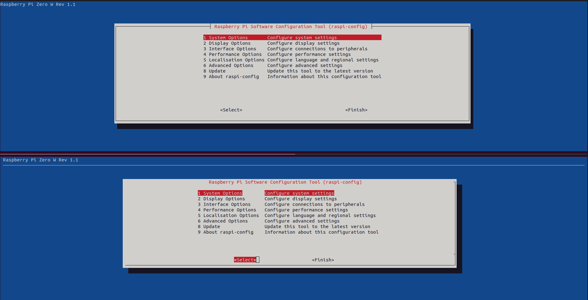
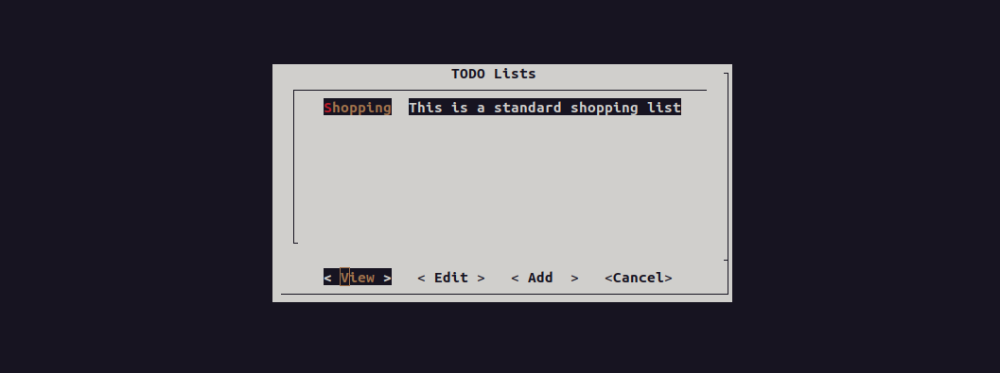
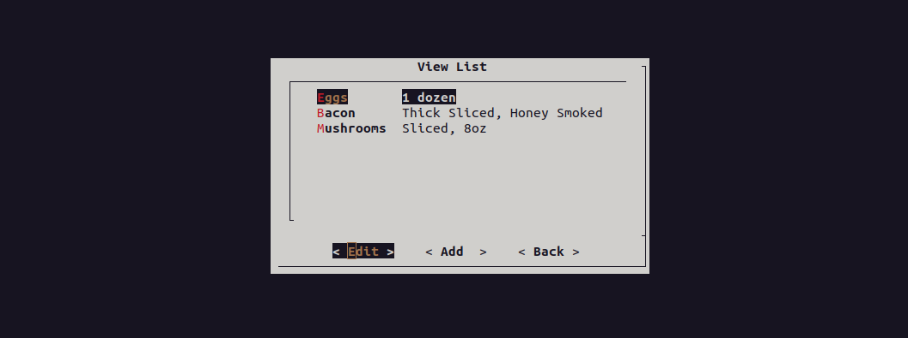

# Examples

This folder demonstrates how easy it is to build or replicate existing
TUI's for configuration.

## Applications

### Raspberry Pi Config


_Figure: raspi-config. The top is the real config while the bottom is generated using [dialog-wheel][1]._

[1]: raspi-config/application.json

### TODO List

We've incldued the standard [todo workflow][2] and [todo application][3].


_Figure: TODO Lists. The main menu for managing lists._


_Figure: Shopping List. The sub listing for the todo list._

Resulting state is:

``` json
{
  "lists": [
    {
      "name": "Shopping",
      "description": "This is a standard shopping list"
    }
  ],
  "Shopping": [
    {
      "name": "Eggs",
      "description": "1 dozen"
    },
    {
      "name": "Bacon",
      "description": "Thick Sliced, Honey Smoked"
    },
    {
      "name": "Mushrooms",
      "description": "Sliced, 8oz"
    }
  ]
}
```

[2]: todo/workflow.yaml
[3]: todo/application.sh